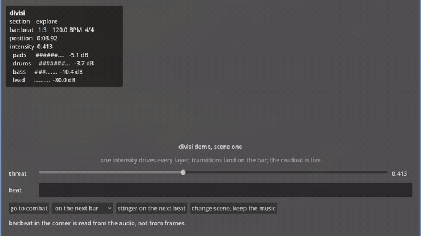
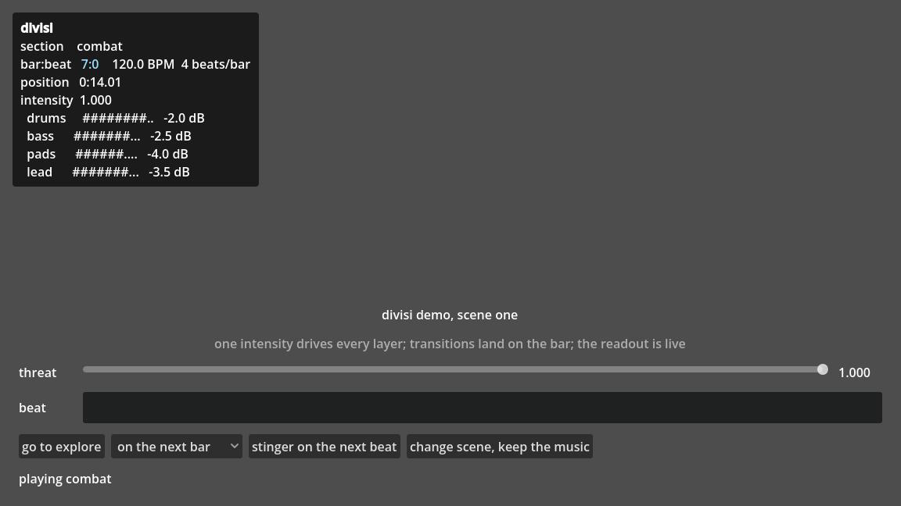

# divisi

Adaptive music for Godot 4: a drift-free musical clock with beat and bar
signals, intensity-driven layers, bar-quantized section transitions and
stingers, on top of the engine's own synchronized streams.

## The problem

Your game's music should react to what the player is doing. Godot 4.3+ will
mix your stems for you with `AudioStreamSynchronized`, but it gives you no
musical clock, no beat or bar signal, and no way to map a gameplay value onto
layer volumes.

## The demo



The clip is the first fifteen seconds, silent because it is a GIF. The same
thirty eight seconds [with sound](docs/demo.webm) runs through everything below.

The repository is itself a Godot project: clone it, open it in Godot 4.4 or
newer, press play. The demo screen shows, in this order:

1. A "threat" slider morphing four stems in and out, in phase, with no clicks.
2. A button that jumps to a second section on the next bar line, landing on
   the downbeat.
3. A UI element pulsing on the `beat` signal, next to a live readout of the
   section, the bar and beat, and every layer's gain.
4. A stinger fired on the next beat over the running mix.
5. A button that changes scene while the music keeps playing, bar position
   intact.



The `bar:beat` line in the readout is the thing to watch. It is read from the
audio device, not from frame deltas, so it is always exactly where the music
is and it stays there. Measured over a ten minute run on real hardware at
120 BPM, beat 1200 landed at position 600.04 s with nothing skipped.

That is the whole argument for reading the device. Godot's own
[audio sync tutorial](https://docs.godotengine.org/en/stable/tutorials/audio/sync_with_audio.html)
warns that a clock built by accumulating `delta` will not hold, because "the
sound hardware clock is never exactly in sync with the system clock, [so] the
timing information will slowly drift away". `DivisiDebug` can show that gap
directly, as an opt-in line, but it is a diagnostic about two clocks rather
than a health reading, so it is off by default.

## Install

Either:

- **Godot Asset Store** (in-editor, Godot 4.7+): search for "divisi" in the
  AssetLib tab and install.
- **Copy the addon**: copy `addons/divisi/` into your project.

Then enable the plugin under Project Settings, Plugins. Enabling it registers
one autoload, `DivisiState`, which is inert unless you use persistence (see
`persist_across_scenes` below).

## Quickstart

Building and playing a section in code, for a clear picture of what a
`DivisiPlayer` actually holds:

```gdscript
extends Node

var player: DivisiPlayer


func _ready() -> void:
	var drums := DivisiLayer.new()
	drums.layer_name = &"drums"
	drums.stream = preload("res://audio/combat_drums.ogg")
	drums.max_db = 0.0

	var lead := DivisiLayer.new()
	lead.layer_name = &"lead"
	lead.stream = preload("res://audio/combat_lead.ogg")
	lead.max_db = -6.0
	var curve := Curve.new()
	curve.add_point(Vector2(0.0, 0.0))
	curve.add_point(Vector2(1.0, 1.0))
	lead.gain = curve

	var combat := DivisiSection.new()
	combat.section_name = &"combat"
	combat.bpm = 120.0
	combat.beats_per_bar = 4
	combat.layers = [drums, lead]

	player = DivisiPlayer.new()
	player.sections = [combat]
	add_child(player)
	player.play(&"combat")
	player.beat.connect(_on_beat)


func _on_beat(index: int) -> void:
	pass


func _process(_delta: float) -> void:
	# The one knob a game is expected to write every frame.
	player.intensity = get_threat_level()


func get_threat_level() -> float:
	# Stand in for your game's own number, from 0 to 1. Wiring this to something real is the
	# whole of divisi's adaptive behaviour.
	return 0.5


func _on_alarm_triggered() -> void:
	player.transition_to(&"explore", DivisiQuantize.NEXT_BAR)
```

The normal way to author sections and layers is as inspector resources, not
code: build a `DivisiSection` and its `DivisiLayer`s as `.tres` files, drop
them into a `DivisiPlayer`'s `sections` array in the editor, and you never
write most of the above. It is shown here in code because code is
unambiguous about which properties exist and what they do.

## What it does

- **`DivisiClock`**: musical time for one `AudioStreamPlayer`, with `beat` and
  `bar` signals. Writing `bpm` or `beats_per_bar` while it is running is a
  tempo or meter change: the beat grid re-anchors where you wrote it, the beat
  and bar counts carry on from there, and nothing is emitted twice or waited
  out in silence. A tempo of zero or less is refused with an error rather than
  clamped to something that never emits again.
- **`DivisiPlayer`**: plays adaptive music, layered sections, bar-quantized
  transitions between them, and stingers over the top. A stinger's duck is
  held for the length of the stinger and released, both counted in plain
  seconds rather than musical time, so pausing the music does not hold the duck
  open for the length of the pause.
- **`DivisiSection`**: a named piece of music, a tempo, a time signature and
  the layers that make it up. Its stems must be imported with Loop ticked; a
  section that runs out stops and says so through `playback_finished`.
- **`DivisiLayer`**: one vertical layer of a section, a stem and how loud it
  is at a given intensity.
- **`DivisiDebug`**: an on-screen readout of a `DivisiPlayer`, section, bar
  and beat, and per-layer gains, with the audio versus system clock gap
  available as an opt-in line.
- **`DivisiState`** (autoload): carries music state across a scene change.
- **`DivisiQuantize`**: the musical boundaries divisi can schedule against,
  `NOW`, `NEXT_BEAT`, `NEXT_BAR`.

## How it compares

Facts below verified as of 2026-08-31.

| | Musical clock, beat/bar signals | Intensity to gain mapping | Bar-quantized transitions | Stingers | Music across scene changes | Your own stems | Licence |
|---|---|---|---|---|---|---|---|
| **Godot built-ins alone** (`AudioStreamSynchronized` + `AudioStreamInteractive`, 4.3+) | No signals at all | No | Has a bar/beat quantized transition table | No | No | Yes | MIT |
| **divisi** | Yes | Yes | Yes | Yes | Yes | Yes | MIT |
| **RhythmNotifier** (michaelgundlach/rhythm_notifier, 64 stars, MIT, on the deprecated Asset Library, last pushed 2025-09-12) | Beat signals only, correctly latency compensated | No | No | No | No | Yes | MIT |
| **Maaack's Music Controller** (Maaack/Godot-Music-Controller, 12 stars, Asset Store, active) | No | No | No | No | Yes, crossfades tracks | Yes | MIT |
| **Pocket Chordsmith** (Samfa12, Asset Store, MIT, active) | Yes | Yes, adaptive state callbacks | Yes | Yes | Not applicable | Chart data from its own web app / Pocket DAW, not your own stems | MIT |
| **Project-DJ-Godot** (RROP, Asset Store, LGPL-2.1, prebuilt binaries, minimum Godot 4.5, publisher marks current version unstable) | Its own beat analysis | Not the point, it is a DJ/rhythm-game audio engine | Not applicable | Not applicable | Not applicable | Its own multitrack mixing and time stretching, replaces the engine's audio path | LGPL-2.1 |
| **Northforge adaptive-music-godot** (3 stars, MIT, dormant since 2026-07-20) | The right API on paper, but its clock accumulates `delta` in `_process`, which the engine's own audio sync tutorial warns drifts | Yes | Yes | Yes | Yes | Yes | MIT |
| **FMOD / Wwise** | Yes, and far more | Yes, and far more | Yes | Yes | Yes | Yes | Commercial, separate authoring tool, native integration to maintain |

`Pocket Chordsmith` genuinely does beat, bar, section, stinger and adaptive
state callbacks; the catch, stated neutrally, is that it is driven by chart
data authored in its own web app and Pocket DAW, so it is an importer for
that ecosystem rather than something you point at your own stems.
`Project-DJ-Godot` replaces the engine's audio path rather than complementing
it, and is aimed at rhythm games rather than game-state-driven music. FMOD
and Wwise are a different category, named here because they are the honest
alternative for a large project.

## What divisi does NOT do

| Not this | Why |
|---|---|
| Sample-accurate scheduling | divisi schedules on frames, so a boundary lands within one frame. Sample-accurate scheduling needs engine support that does not exist; see [godot-proposals#8937](https://github.com/godotengine/godot-proposals/issues/8937), open since 2024-01-22. |
| Reimplemented mixing | `AudioStreamSynchronized` does that, correctly, and divisi only writes volumes into it. |
| Generative or procedural music | [BarelyMusician](https://github.com/anokta/BarelyMusician) does that. |
| Sound pooling or SFX management | Resonate and the engine's own `AudioStreamPolyphonic` do that. |
| Tempo or key detection | You tell divisi the tempo. |
| Sidechain compression | The stinger duck is a plain level dip on the music players; nothing analyses the stinger's envelope. |
| An editor main-screen panel in v0.1 | Sections and layers are inspector resources. |
| Overlapping crossfades | There are two music players, so a transition scheduled while another crossfade is still running replaces the oldest section rather than layering a third. The levels stay continuous, but the content is spliced on both sides: halfway through a fade both players sit at 0.707 amplitude, so the section being cut stops there and the incoming one starts there rather than fading in from silence. Keep `transition_seconds` shorter than the gap between transitions. |
| Music that keeps counting while the scene tree is paused | `_process` stops and the audio server does not, so on unpause the clock jumps forward and reports the gap in `skipped_beats`. Pause the music too, or give the player a `process_mode` that survives the pause. |
| Introducing a new layer mid-track, in phase | The engine starts every sub playback of a synchronized stream together, so a layer cannot join at the correct phase later. |

## Requirements

Godot 4.4 or newer, tested in CI on 4.4 and 4.7. Pure GDScript, no
GDExtension, no per-platform binaries.

## Engine facts appendix

divisi's design is shaped by specific, verified engine behaviour and specific
open bugs. Every line number below was read from the tagged source on
2026-08-31 and holds at both matrix versions.

- `AudioStreamPlaybackSynchronized::mix()` reads each layer's volume from the
  resource on every mix chunk, so a runtime volume write takes effect on the
  next chunk: `modules/interactive_music/audio_stream_synchronized.cpp:231`
  at tag `4.4-stable`, `:232` at `4.7.2-stable`.
- Gain is a scalar per 128-frame chunk (`MIX_BUFFER_SIZE`,
  `audio_stream_synchronized.h:84` at 4.4-stable, `:85` at 4.7.2-stable), so a
  script-driven fade is a staircase at the frame rate, not a
  sample-interpolated ramp.
- Per-layer volume lives on the `Resource`, not on the playback
  (`audio_stream_synchronized.h:51` at 4.4-stable, `:50` at 4.7.2-stable),
  which is why divisi builds a separate stream instance per player during a
  crossfade.
- `start()` starts every sub playback at the same position (`.cpp:196` at
  4.4-stable, `:197` at 4.7.2-stable), which is what phase-locks the layers,
  and also why a layer cannot join mid-track.
- The module emits no signals: grepping both source files at both tags, the
  only `emit_signal` is `parameter_list_changed`.
- Open issues that shaped the decision to schedule crossfades on divisi's own
  clock rather than through the engine's transition table:
  [godot#94538](https://github.com/godotengine/godot/issues/94538) (pop and
  mistiming in seamless transitions),
  [godot#99384](https://github.com/godotengine/godot/issues/99384) (breaks
  when modified while playing), and
  [godot#110216](https://github.com/godotengine/godot/issues/110216) (clips
  cannot loop). This is why divisi does its own fades.
- [godot#81542](https://github.com/godotengine/godot/pull/81542), which would
  add beat and bar getters, open since 2023-09-11.

## Licence

MIT. See [LICENSE](LICENSE). The demo audio in `demo/audio/` is CC0 and was
synthesised for this project; see `demo/audio/LICENSE`.
